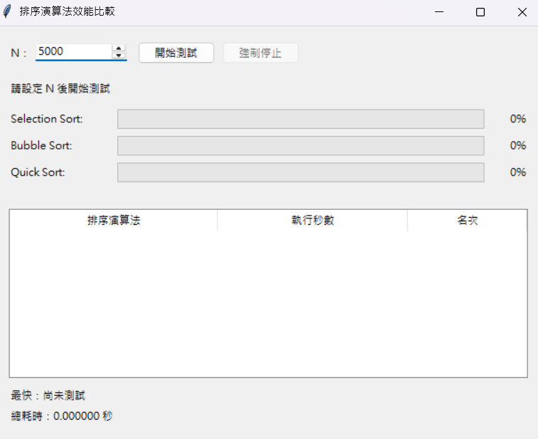
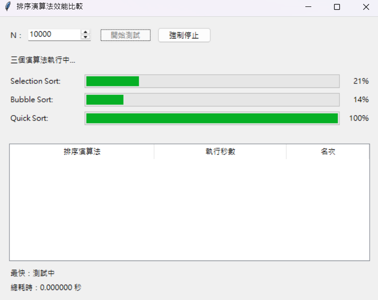
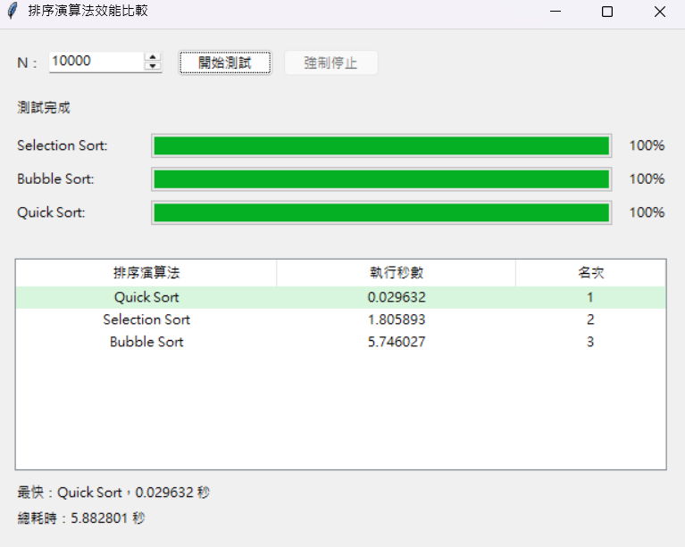
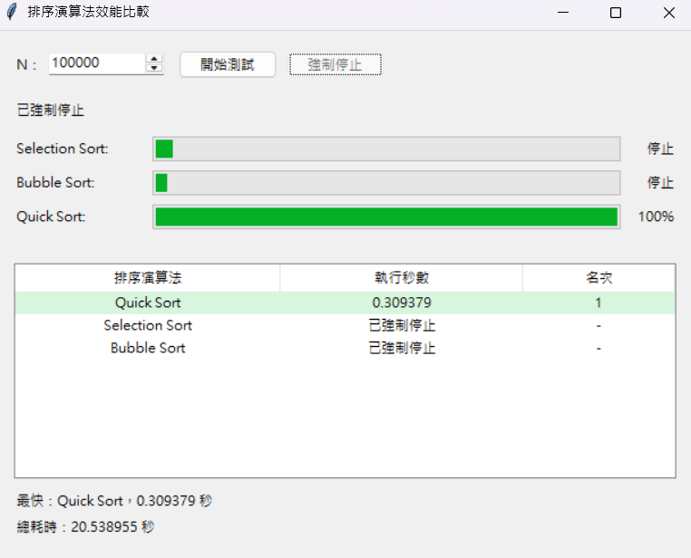

# hw3_Sort 比較三個演算法效能的 GUI

## 功能
1. 選擇要排序的陣列大小 (數值 N)
2. 讓三個演算法進行陣列中數字排序 (小到大)
3. 進度條顯示每個演算法的當下進度
4. 顯示各個演算法分別花了幾秒
5. 排名三個演算法排序速度
6. 有終止按鈕避免跑不完

## 我做的事
- 寫出三個演算法的函式
- 將 GUI 設計想法告訴 chatGPT 請他幫我做初版
- 讀懂 GUI 程式的語法，並修改成我真正想要的樣子
- 請 chatGPT 運用多 thread 讓三個演算法同時進行

## 原本我的三個演算法程式
### 選擇排序(Selection sort)
```
def SelectSort(Array):
    for i in range(len(Array)):
        min_index = i

        for j in range(i+1, len(Array)):
            if Array[j] < Array[min_index]:
                min_index = j

        Array[i], Array[min_index] = Array[min_index], Array[i]

    return Array
```

### 泡泡排序(Bubble sort)
```
def BubbleSort(Array):
    n = len(Array)
    for i in range(n-1):
        for j in range(i+1, n):
            if Array[i] > Array[j]:
                Array[i],Array[j] = Array[j],Array[i]
    return Array
```

### 快速排序(Quick sort)
```
def QuickSort(Array,Start,End):
    if Start >= End:
        return Array
    pivot = Array[Start]
    left = Start
    right = End

    while left < right:
        while Array[right] >= pivot and right > left:
            right -= 1
        while Array[left] <= pivot and right > left:
            left += 1
        Array[left], Array[right] = Array[right], Array[left]
    Array[Start], Array[right] = Array[right], Array[Start]
    QuickSort(Array,Start,right-1)
    QuickSort(Array,right+1,End)

    return Array
```

## chatGPT 做的事
- 幫我的程式加上 GUI 介面
- 修改我的演算法程式讓他除了排序還能回報當下進度
- 視覺化呈現各個演算法進度
- 實現多 thread 讓三個演算法同時進行

## 實際跑程式

### 初始畫面

可更改 N 來決定要排序的陣列大小

### 開始跑演算法


- 三個演算法同時排序同一個陣列
- 有視覺化的進度條顯示
- 有計算進度(%)

### 跑完演算法後


- 會顯示三個演算法各花了多少時間
- 所花時間排名

### 強制停止


- 避免 N 太大時跑不完
- 有強制停止按鈕可即時暫停
- 強制停止時若有演算法已經排序完，仍會顯示其成績
